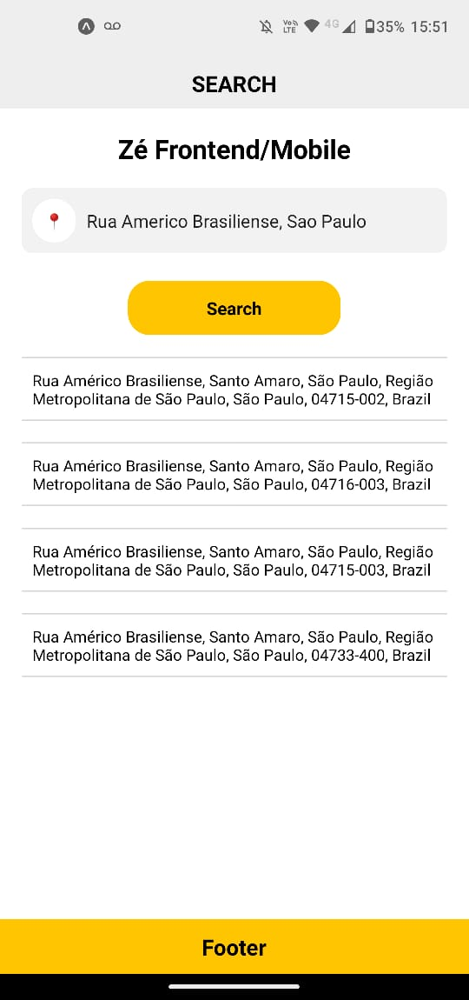
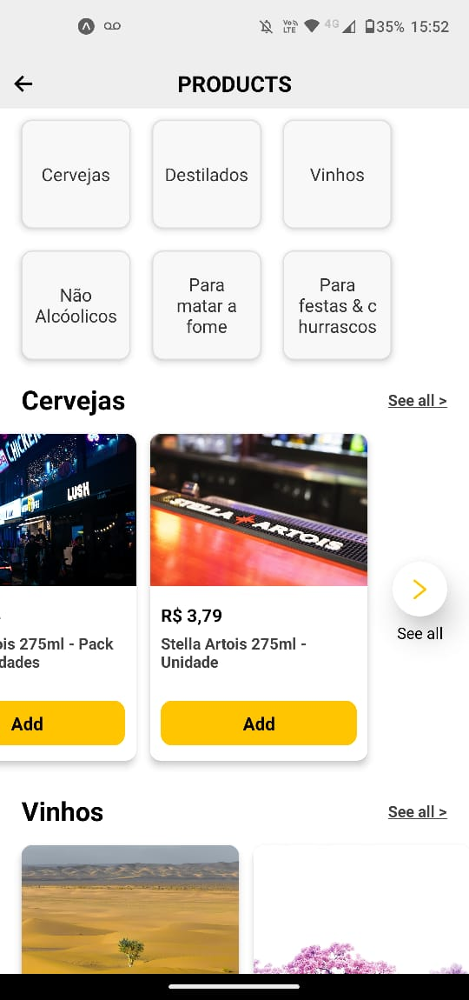
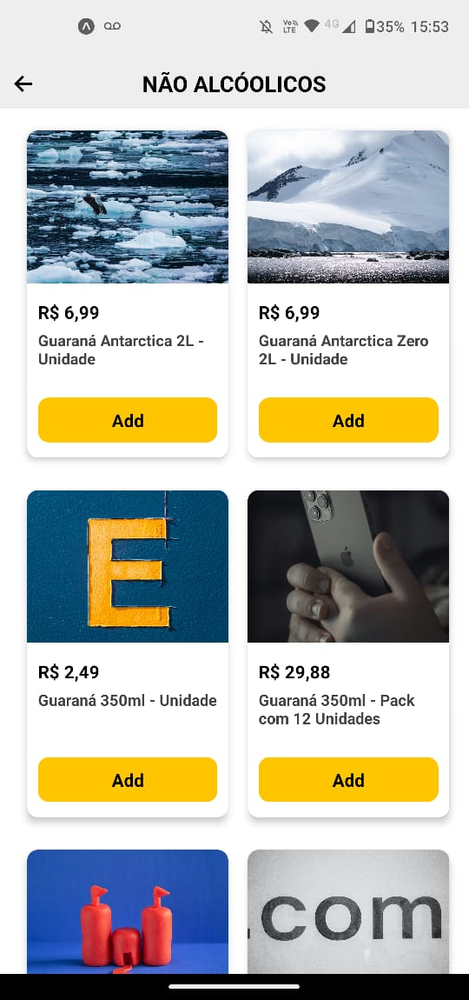
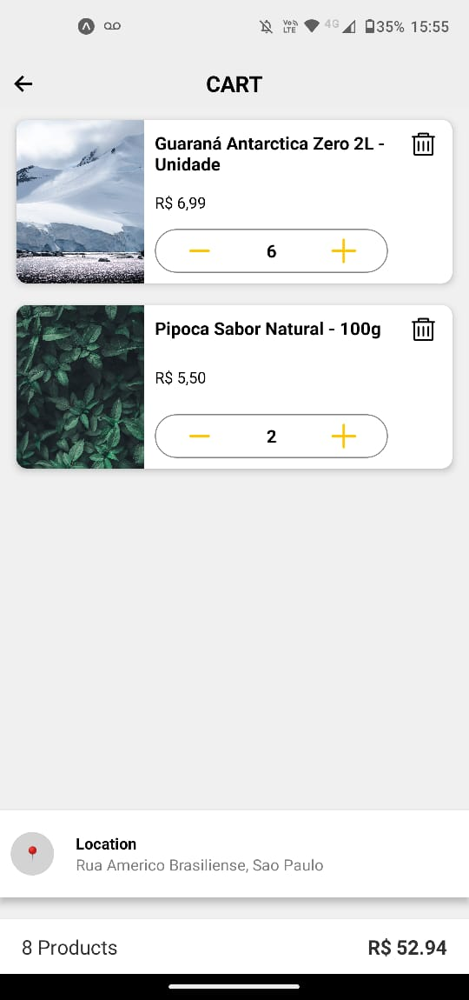
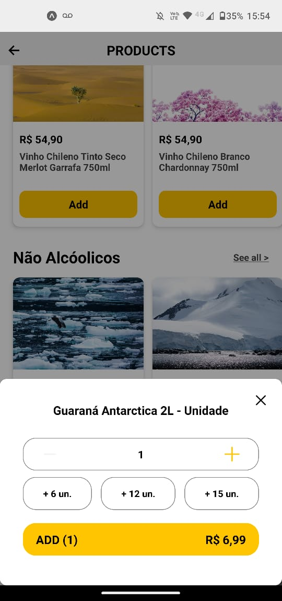

# Zé Delivery Frontend Challenge

This is a React Native app that implements the Zé Delivery frontend challenge using Expo and TypeScript.

## Table of Contents
- [Zé Delivery Frontend Challenge](#zé-delivery-frontend-challenge)
  - [Table of Contents](#table-of-contents)
  - [About the app](#about-the-app)
  - [How to run the app](#how-to-run-the-app)
  - [Challenge link](#challenge-link)
  - [Screenshots](#screenshots)

## About the app

The app consists of four screens:

- A **SearchLocationPage** where the user can type an address and see location suggestions using the [LocationIQ API]. The app also finds the coordinates of the searched location and passes them to the next screen using the address context provider.
- A **ProductsPage** where the user can see the products available for the selected address, grouped by category. The app uses GraphQL to communicate with the Zé Delivery API and fetch the data for the distributors, products and categories.
- A **CategoryPage** where the user can see the products of the selected category and add them to the cart. 
- A **CartPage** where the user can see the products added to the cart and manage them. The app also shows the product details, like image, price and quantity and  functionality to add, remove, and also manage the quantity by product and show the total of products and total to pay.

The app uses expo-router to handle the navigation between the screens.

The app also uses the Context API to manage the global state of the app, such as the cart items, the selected address and the selected distributor.

## How to run the app

To run the app, you need to have Node.js, Expo CLI and an Android or iOS emulator installed on your machine.

You also need to rename the `.env.example` file to `.env` and replace `YOUR_ACCESS_TOKEN` with your own access token from the LocationIQ API.

You can follow these steps to run the app:

- Clone this repository: `git clone https://github.com/ThiDiamondDev/ze-delivery-frontend.git`
- Go to the project folder: `cd ze-delivery-frontend`
- Install the dependencies: `npm install`
- Start the app: `expo start`
- Open the app on your emulator or scan the QR code with the Expo app on your device.

## Challenge link

You can find the original challenge description and requirements [here](https://github.com/ab-inbev-ze-company/ze-code-challenges/blob/master/backend.md).

## Screenshots

Here are some screenshots of the app:

